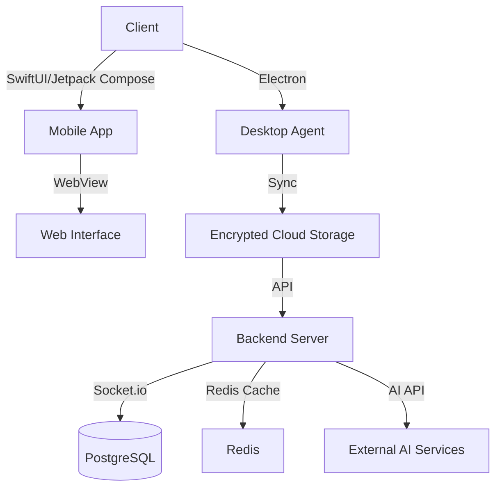

# Nomad IDE
**Your full AI coding environment, anywhere — phone continues what desktop started.**

Nomad IDE is a mobile-first, AI-augmented coding environment designed for iOS and Android. It provides true context-persistent handoff from desktop coding sessions, specifically targeting Claude Code and Codex workflows. A lightweight desktop agent synchronizes your active repo state, open files, terminal history, and AI conversation context to mobile devices via encrypted cloud, allowing you to continue exactly where you left off. On-device Apple Foundation Models handle code completion and explanation for privacy, with complex tasks routed to the Claude or OpenAI API.

## Features
- Desktop agent (Mac/Windows) snapshots active repo state, terminal history, and AI chat context, syncing to mobile in under 10 seconds.
- On-device Apple Foundation Models for private, instant code completion and explanation.
- Vision-based code screenshot parsing and voice-driven coding via GPT-Realtime-2.
- Seamless integration with Claude Code and Codex workflows.

## Tech Stack

**Frontend**
- iOS: SwiftUI (Version 5.0)
- Android: Jetpack Compose (Version 1.2.0)
- Desktop Agent: Electron (Version 25.0)
- Web: CodeMirror (Version 6.0) within SwiftUI WebView

**Backend**
- Server: Node.js (Version 18.x)
- WebSocket Management: Socket.io (Version 4.3)

**Database**
- PostgreSQL (Version 14)
- Redis (Version 7.0)

**Infrastructure**
- Cloud Storage: AWS S3
- Authentication: AWS Cognito with JWT
- CI/CD: GitHub Actions

**AI Integration**
- On-device AI: Apple Foundation Models Framework (Model: .default)
- External APIs: Anthropic Claude API (claude-opus-4), OpenAI GPT-Realtime-2 API
- Image Processing: Apple Vision API

## Architecture
Nomad IDE is structured to provide seamless interaction between desktop and mobile environments, maintaining full session context. The architecture leverages a combination of on-device AI models for privacy and external APIs for complex tasks.



## Project Structure
```plaintext
NomadIDE/
├── backend/
│   ├── src/
│   │   ├── controllers/
│   │   ├── models/
│   │   ├── routes/
│   │   ├── services/
│   │   └── utils/
│   ├── config/
│   ├── tests/
│   └── app.js
├── mobile/
│   ├── ios/
│   │   ├── NomadIDE/
│   │   └── Shared/
│   └── android/
│       ├── app/
│       └── shared/
├── desktop-agent/
│   └── src/
│       ├── main/
│       ├── renderer/
│       └── assets/
└── shared/
    ├── business-logic/
    └── api-clients/
```

## Getting Started

### Prerequisites
- Node.js (Version 18.x)
- PostgreSQL (Version 14)
- Redis (Version 7.0)
- AWS account for S3 and Cognito

### Installation
1. Clone the repository:
   ```bash
   git clone https://github.com/yourusername/NomadIDE.git
   ```
2. Navigate to the backend directory and install dependencies:
   ```bash
   cd NomadIDE/backend
   npm install
   ```

### Environment Variables
Create a `.env` file in the `backend` directory, based on `.env.example`, and configure the necessary environment variables.

### Running
1. Start the backend server:
   ```bash
   npm start
   ```
2. Launch the desktop agent and mobile app according to their respective platform instructions.

## Documentation
- [Product Requirements](docs/PRD.md)
- [Design Brief](docs/DESIGN.md)
- [Architecture](docs/ARCHITECTURE.md)

## License
This project is licensed under the MIT License.